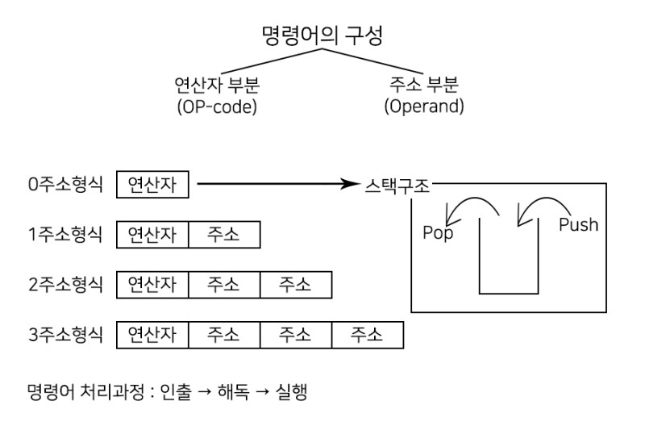
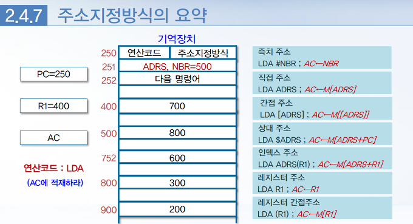

# 2강. 컴퓨터 명령(Ⅱ)

## 1. 명령어 형식

#### (2.3.2) 오퍼랜드의 수에 따른 명령어 형식

- 오퍼랜드의 개수에 따라

  1. 3-주소 명령어(three-address instruction)
  2. 2-주소 명령어(two-address instruction)
  3. 1-주소 명령어(one-address instruction)
  4. 0-주소 명령어(zero-address instruction)

  

  > 출처 : https://youngminip.blogspot.com/2019/04/2.html

- `3-주소 명령어`

  - 오퍼랜드의 개수가 `세 개`인 명령어 형식
  - 위 그림 참조
  - ADD R1, R2, R3 
    - 레지스터를 이용한 명령어
    - 다중레지스터를 이용한 명령어 이다 라고 말할 수도 있다.
  - 3-주소 명령어 예)

  ```C++
  산술식 X = ( A + B ) X C 에 대해 3-주소 명령어를 이용한 프로그램
  	ADD A, B, R1 ; R1 ← M(A) + M(B)
  	MUL R1, C, X ; M(X) ← R1 X M(C)
  ```

  - 
    - 장점 : 산술식을 프로그램화 하는데 있어서 프로그램의 `길이가 짧아짐`
    - 단점 : 3-주소명령어를 2진 코드화 했을 때 세 개의 오퍼랜드를 나타내기 위한 `비트 수가` 다른 주소 명령어 형식보다 `많이 필요하다.`

- `2-주소 명령어`

  - 오퍼랜드의 개수가 `두 개`인 명령어 형식

  - 상업용 컴퓨터에서 가장 많이 사용

  - 위 그림 참고

  - 2-주소 명령어 예)

    ```C++
    산술식 X = (A + B) X C에 대해 2-주소 명령어를 이용한 프로그램
    	MOVE A, R1 ; R1 ← M(A)
    	ADD B, R1 ; R1 ← R1 + M(B)
    	MUL C, R1 ; R1 ← R1 * M(C)
    	MOVE R1, X ; M(X) ← R1
    ```

    - 장점 : 3-주소 명령어에 비해 명령어의 `길이는 짧아짐`
    - 단점 : 같은 내용을 수행하기 위해 수행해야 하는 명령어의 `수는 증가됨`

- `1-주소 명령어`

  - 오퍼랜드의 개수가 `하나`인 명령어 형식

  - 기억장치로부터 오퍼랜드를 가져오거나 연산결과를 저장하기 위한 임시적인 장소로 `누산기 레지스터를 사용`한다.

  - 위 그림 참고

  - 1-주소 명령어 예)

    ```C++
    산술식 X = (A + B) X C에 대해 1-주소 명령어를 이용한 프로그램
    	LOAD A ;  AC ← M(A)
    	ADD B ;   AC ← AC + M(B)
    	STORE X ; M(X) ← AC
    	LOAD C ;  AC ← M(C)
    	MUL X ;   AC ← AC X M(X)
    	STORE X ; M(X) ← AC
    ```

    - 장점 : 모든 연산은 누산기 레지스터와 기억장치에 저장된 오퍼랜드를 대상으로 수행
    - 단점 : 프로그램을 수행하기 위해 사용되는 `명령어의 수는 더 증가`

- 0-주소 명령어

  - 스택 구조에서 사용되는 형식

  - 주소필드를 사용하지 않는다.

  - 위 그림 참고

  - 0-주소 명령어 예)

    ```C++
    산술식 X = (A + B) X C에 대해 0-주소 명령어를 이용한 프로그램
        PUSH A ; TOS ← M(A)
        PUSH B ; TOS ← M(B)
        ADD	   ; TOS ← TOS + TOS-1
        PUSH C ; TOS ← M(C)
        MUL    ; TOS ← TOS X TOS-1
        POP X  ; M(X) ← TOS
    ```

    - 장점 : 명령어의 길이가 매우 짧아서 `기억공간을 적게 차지`
    - 단점 : 특수한 경우를 제외하고는 많은 양의 정보가 스택과 기억장치 사이를 이동하게 되어 `비효율적`

## 2. 주소지정방식

#### (2.4) 주소 지정 방식

- 명령어 주소지정방식(addressing mode)
  - 프로그램 수행 시 `오퍼랜드`를 지정하는 방식
  - 명령어의 주소 필드를 변경하거나 해석하는 규칙을 지정하는 형식
  - `주소지정방식을 사용하면 명령어의 수를 줄일 수 있는 효과적인 프로그래밍 가능`
- 유효주소
  - 주소지정방식의 각 규칙에 의해 정해지는 오퍼랜드의 `실제 주소(effected address)`
- 별도의 주소지정방식 필드를 가진 명령어 형식
  - `연산코드` - `주소지정방식` - `주소 혹은 오퍼랜드`
  - 3개의 필드로 이루어져 있는 명령어 형식이 있다면 가운데는 `주소지정방식` 필드가 될 것이다.
    - 연산코드 필드
      - 수행할 `연산의 종류`를 지정
    - 주소지정방식 필드 (addressing mode field)
      - 연산에 필요한 오퍼랜드의 주소를 알아내는 데 사용
    - 주소 혹은 오퍼랜드 필드
      - `기억장치주소` 혹은 `레지스터`를 나타낸다.
- 주소지정방식의 종류
  1. 의미
  2. 즉치
  3. 직접
  4. 간접
  5. 레지스터
  6. 레지스터 간접
  7. 상대
  8. 인덱스된

#### (2.4.1) 의미주소지정방식

1. 의미 주소지정방식(implied mode)
   - 명령어 형식에서 주소 필드를 필요로 하지 않는 방식
   - 연산코드 필드에 지정된 묵시적 의미의 오퍼랜드를 지정
   - `<예>` ADD ; TOS ← TOS + TOS<sub>-1</sub> ( 스택 자료구조 )
     - 기억장치 스택에서 ADD와 같은 명령어는 스택의 맨 위 항목과 그 아래 항목을 더하여 스택의 맨 위에 저장하는 명령어로서, `오퍼랜드가 스택의 맨 위에 있다는 것을 묵시적으로 가정함`
2. 즉치 주소지정방식(immediate mode)
   - 명령어 자체 내에 오퍼랜드를 지정하고 있는 방식
   - `오퍼랜드 필드의 내용이 실제 사용될 데이터`
   - 레지스터나 변수의 초기화에 유용
   - `<예>` LDI 100, R1 ; R1 ← 100
     - LDI - LOAD IMMEDIATE
     - 100은 주소가 아니라 실제 데이터를 넣어 주소가 필요 없음
3. 직접 주소지정방식(direct-addressing mode)
   - 명령어의 주소필드에 직접 오퍼랜드의 주소를 저장시키는 방식
   - 기억장치에 접근이 한번에 이루어짐
   - `<예>` LDA ADRS ; AC ← M[ADRS]
     - LDA 500 ; AC ← M[500]으로 인식
     - 데이터가 아니라 `해당 값에 주소로 이동`
     - LDA란 `LOAD ACCUMULATOR`의 약자
     - LDA란 `ACCUMULATOR로 적재해라` 라는 뜻
4. 간접 주소지정방식(indirect-addressing mode)
   - 명령어의 주소 필드에 `유효주소가 저장`되어있는 기억장치 주소를 기억시키는 방식
   - `<예>` LDA [ADRS] ; AC ← M[M[ADRS]]
   - LDA [500] ; AC ← M[M[500]] 이 되며, M[500]의 값을 한번 더 주소로 사용하는 방식
5. 레지스터 주소지정방식(register mode)
   - 오퍼랜드 필드에 레지스터가 기억되는 방식
   - 레지스터에 오퍼랜드가 들어있음(`유효주소가 없음`)
   - `<예>` LDA R1 ; AC ← R1
6. 레지스터 간접 주소지정방식(register-indirect mode)
   - 레지스터가 실제 오퍼랜드가 저장된 기억장치의 주소 값을 갖고 있는 방식
   - `<예>` LDA (R1) ; AC ← M[R1]
     - R1에 들어있는 내용을 주소값으로 사용하는 것.
7. 상대 주소지정방식(relative addressing mode)
   - 유효주소를 계산하기 위해 처리장치 내에 있는 특정 레지스터의 내용에 명령어 주소필드 `값`을 더하는 방식
   - 특정 레지스터로 `프로그램 카운터(PC)`가 주로 사용
   - `<예>` LDA $ADRS ; AC ← M[ADRS + PC]
     - LDA $500 ; AC ← M[500 + PC]  (PC = program counter)
     - 유효주소 = 명령어 주소부분의 내용 + PC의 내용
8. 인덱스된 주소지정방식(indexed addressing mode)
   - 인덱스 레지스터의 내용을 명령어 주소 부분에 더해서 유효주소를 얻는 방식
   - `<예>` LDA ADRS(R1) ; AC ← M[ADRS + R1]
     - 유효주소 = 명령어 주소부분의 내용 + 인덱스 레지스터의 내용

#### 2.4.7 주소지정방식의 요약



> 출처 : https://booolean.tistory.com/554

- 인출 → 해석 → 실행 → 반복

- 일반적으로 인출 되면 프로그램 카운터(PC)가 1이 증가 (기억공간의 번지 수)

  ```C++
  초기 조건 - 위 그림 좌측 참고
  
  ADRS, NBR = 500
  
  즉치 주소방식
  	- 오퍼랜드 500이 AC로 로드된다.
  직접 주소방식
  	- 직접방식에서는 유효주소가 500이 되며, AC에 로드되는 오퍼랜드는 800이 된다.
  간접 주소방식
  	- 유효주소가 800이 되며, 오퍼랜드 주소는 300이 된다.
  상대 주소방식
  	- 유효주소가 500 + 252 = 752이고, 오퍼랜드 주소는 600이다.
  인덱스 주소방식
  	- R1이 인덱스 레지스터라고 하면 유효주소가 500 + 400 = 900이 된다.
  레지스터 주소방식
  	- 오퍼랜드를 R1값이 지정하고 있어서 오퍼랜드 400 AC로 로드된다.
  레지스터 간접방식
  	- 유효주소가 R1값이 되며, AC로 로드되는 오퍼랜드 주소 400에 있는 700이 된다.
  ```

  |      주소지정방식      |   기호표기   |  레지스터 전송   | 유효주소 | AC의 이용 |
  | :--------------------: | :----------: | :--------------: | :------: | :-------: |
  |       즉치 주소        |   LDA #NBR   |     AC ← NBR     |   251    |    500    |
  |       직접 주소        |   LDA ADRS   |   AC ← M[ADRS]   |   500    |    800    |
  |       간접 주소        |  LDA[ADRS]   | AC ← M[M[ADRS]]  |   800    |    300    |
  |       상대 주소        |  LDA $ADRS   | C ← M[ADRS + PC] |   752    |    600    |
  |      인덱스 주소       | LDA ADRS(R1) | AC ←M[ADRS + R1] |   900    |    200    |
  |     레지스터 주소      |    LDA R1    |     AC ← R1      |    -     |    400    |
  | 레지스터<br />간접주소 |   LDA (R1)   |    AC ← M[R1]    |   400    |    700    |

## 3. 명령어의 종류

#### 2.5 명령어의 종류

- 데이터 전송 명령어

  - 한 장소에서 다른 장소로 단지 데이터를 전송하는 명령어
  - 레지스터와 레지스터 사이, 레지스터와 기억장치 사이, 또는 기억장치와 기억장치 사이에 데이터를 이동하는 기능
  - 입출력 명령어가 포함

  | 전송 명령어 | 니모닉 | 기 능                                                    |
  | ----------- | ------ | -------------------------------------------------------- |
  | Load        | LD     | 기억장치로부터 레지스터로의 전송                         |
  | Store       | ST     | 레지스터로부터 기억장치로의 전송                         |
  | Move        | MOVE   | 레지스터로부터 다른 레지스터로의 전송                    |
  | Exchange    | XCH    | 두 레지스터 간 또는 레지스터와 기억장치 간의 데이터 교환 |
  | Push        | PUSH   | 기억장치의 스택과 레지스터 간의 데이터 전송              |
  | Pop         | POP    | 기억장치의 스택과 레지스터 간의 데이터 전송              |
  | Input       | IN     | 레지스터와 입출력장치 간의 데이터 전송                   |
  | Output      | OUT    | 레지스터와 입출력장치 간의 데이터 전송                   |

  

- 데이터 처리 명령어

  - 데이터에 대한 연산을 실행하고 컴퓨터 계산능력을 제공

    1. 산술 명령어

       - 사칙연산에 대한 명령어

         | 산술 명령어          | 니모닉 | 기 능              |
         | -------------------- | ------ | ------------------ |
         | Increment            | INC    | 1 증가             |
         | Decrement            | DEC    | 1 감소             |
         | Add                  | ADD    | 덧셈               |
         | Subtract             | SUB    | 뺄셈               |
         | Multiply             | MUL    | 곱셈               |
         | Divide               | DIV    | 나눗셈             |
         | Add with carry       | ADDC   | 캐리를 포함한 덧셈 |
         | Subtract with borrow | SUBB   | 빌림을 포함한 뺄셈 |
         | Negate               | NEG    | 2의 보수           |

    2. 논리와 비트 처리 명령어

       - 레지스터나 기억장치에 저장된 단어에 대한 `2진 연산`

       - 주로 2진 부호화 정보를 표현하는 비트 그룹이나 개별 비트를 처리하는데 사용

       - 비트 값을 0으로 만들거나, 기억장치 레지스터에 저장된 오퍼랜드에 새로운 비트 값을 삽입하는 것 등이 가능

         | 논리 명령어      | 니모닉 | 기 능                  |
         | ---------------- | ------ | ---------------------- |
         | Clear            | CLR    | 모든 비트를 0으로 리셋 |
         | Set              | SET    | 모든 비트를1로 셋      |
         | Complement       | COM    | 모든 비트를 반전       |
         | AND              | AND    | 비트별 AND 연산        |
         | OR               | OR     | 비트멸 OR 연산         |
         | Exclusive-OR     | XOR    | 비트별 XOR 연산        |
         | Clear carry      | CLRC   | 캐리 비트의 리셋       |
         | Set carry        | SETC   | 캐리 비스의 셋         |
         | Complement carry | COMC   | (반전)보수             |

    3. 시프트 명령어

       - 오퍼랜드의 비트를 왼쪽이나 오른쪽으로 이동시키는 명령어
       - 논리적 시프트와 산술적 시프트, 회전형 시프트 연산 등이 있음

       | 시프트 명령어           | 니모닉 | 기 능                                               |
       | ----------------------- | ------ | --------------------------------------------------- |
       | Logical shift right     | SHR    | 오른쪽 시프트 (왼쪽의 남는 비트는 0으로 채움)       |
       | Logical shift left      | SHL    | 왼쪽 시프트 (오른쪽의 남는 비트는 0으로 채움)       |
       | Arithmetic shift right  | SHRA   | 부호비트는 고정(왼쪽의 남는 비트는 부호비트로 채움) |
       | Arithmetic shift left   | SHLA   | 부호비트는 고정(오른쪽의 남는 비트는 0으로 채움)    |
       | Rotate right            | ROR    | 오른쪽으로 순환(버려지는 비트는 다시 왼쪽비트로)    |
       | Rotate left             | ROL    | 왼쪽으로 순환(버려지는 비트는 다시 오른쪽 비트로)   |
       | Rotate right with carry | RORC   | 캐리를 포함한 오른쪽 순환                           |
       | Rotate left with carry  | ROLC   | 캐리를 포함한 왼쪽 순환                             |

- 프로그램 제어 명령어

  - 프로그램 수행의 흐름을 제어

  - 다른 프로그램의 세그먼트 (segment)로 분기

    | 제어 명령어             | 니모닉 | 기 능                                               |
    | ----------------------- | ------ | --------------------------------------------------- |
    | Branch                  | BR     | 조건 혹은 무조건적으로 유효주소로 분기              |
    | Jump                    | JMP    | 조건 혹은 무조건적으로 유효주소로 분기              |
    | Skip next instruction   | SKP    | 조건이 만족되면 다음 명령어를 수행하지 않고 넘어감  |
    | Call procedure          | CALL   | 서브루틴 호출                                       |
    | Return from precedure   | RET    | 서브루틴 실행 후 복귀                               |
    | Compare(by subtraction) | CMP    | 두 오퍼랜드의 뺄셈을 통해 상태 레지스터의 값을 변환 |
    | Test (by ANDing)        | TEST   | 논리 AND 연산만 구현                                |

    