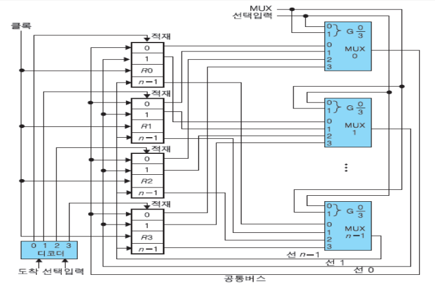

# 3강. 처리장치(1)

## 학습목차

1. 처리장치의 개요
2. 마이크로 연산
3. 처리장치의 구성요소
4. 내부버스


---


## 1. 처리장치의 개요

### 3.1 처리장치의 개요

- 중앙처리장치(CPU: Central Processing Unit)

  - 처리장치와 제어장치가 결합된 형태

    - 처리장치 : 데이터를 처리하는 연산을 실행

    - 제어장치 : 연산의 실행순서를 결정

      

  - 처리장치와 제어장치의 관계

    

- 처리장치의 구성

  - `산술논리`연산장치와 `레지스터`들로 구성
    - `산술논리연산장치`(ALU: Arithmetic and Logic Unit)
      - 산술, 논리, 비트연산 등의 연산을 수행
    - 레지스터(Register)
      - 연산에 사용되는 데이터나 연산의 결과를 저장
    - `산술논리연산장치(ALU)는 독립적으로 데이터를 처리하지 못하며, 반드시 레지스터들과 조합하여 데이터를 처리`

## 2. 마이크로 연산

### 3.2 마이크로 연산

- `레지스터에 저장되어 있는 데이터에 대해 이루어 지는 기본적인 연산`
  - 한 레지스터의 내용을 다른 레지스터로 옮기는 것
  - 두 레지스터의 내용을 합하는 것
  - 레지스터의 내용을 1만큼 증가시키는 것 등
  - `처리장치의 동작원리를 이해하기 위해서는 마이크로 연산을 이해해야 함`
- 마이크로 연산의 종류
  - 레지스터 전송 마이크로 연산(register transfer micro-operation)
  - 산술 마이크로 연산(arithmetic micro-operation)
  - 논리 마이크로 연산(logic micro-operation)
  - 시프트 마이크로 연산(shift micro-operation)

### 3.2.1 레지스터 전송 마이크로 연산

- 레지스터의 표현

  

- `한 레지스터의 내용을 다른 레지스터로 2진 데이터를 전송하는 연산`

  - 레지스터 사이의 데이터 전송은 연산자 `'←'` 로 표시
  - <예> R2 ← R1 (MOVE R1, R2; 와 같다.)
  - <의미> 레지스터 R1의 내용이 레지스터 R2로 전송
    - 여기서 R1 : 출발 레지스터 (source register)
      		 R2 : 도착 레지스터 (destination register) 

- 하드웨어적인 측면에서의 레지스터 전송

  - <예> 레지스터 R1에서 R2로의 전송

    

  - <T<sub>1</sub> = 1인 상태에서 R1에서 R2로의 데이터 `병렬` 전송>

- 레지스터 전송문

  - 앞의 그림을 조건문으로 표현하면

    ```
    if(T1 = 1) then (R2 ← R1)
    ```

  - 레지스터 전송문으로 표현하면

    ```
    T1 : R2 ← R1
    ```

- 레지스터 전송문장에서 사용되는 기본적인 기호

  | 기호                | 의미                                              | 사용예                                                       |
  | ------------------- | ------------------------------------------------- | ------------------------------------------------------------ |
  | 영문자(숫자와 함께) | 레지스터를 표시                                   | AR(ADDRESS REGISTER),<br />R2(2번째 레지스터),<br />DR(DATA REGISTER), <br />IR(INSTRUCT REGISTER) |
  | 괄호                | 레지스터의 일부분                                 | R2(1), R2(7:0), AR(1)                                        |
  | 쉼표                | 동시에 실행되는 두 개 이상의 마이크로 연산을 구분 | R1 ← R2, R2 ← R1<br />T1 = 1일때                             |
  | 화살표              | 자료의 이동 표시                                  | R1 ← R2                                                      |
  | 대괄호              | 메모리에서의 어드레스                             | DR ← M[AR]                                                   |

### 3.2.2 산술 마이크로 연산

- 레지스터 내의 데이터에 대해서 실행되는 산술연산

  - 기본적인 산술연산으로는 덧셈, 뺄셈, 1 증가, 1감소, 그리고 보수 연산이 있다.

    

### 3.2.3 논리 마이크로 연산

- 레지스터 내의 데이터에 대한 비트를 조작하는 연산

  - 기본적인 논리연산으로는 AND, OR, XOR, NOT 연산이 있다.

    

### 3.2.4 시프트 마이크로 연산

- 레지스터 내의 데이터를 시프트 (shift) 시키는 연산

  - 데이터의 측면 이동에 사용

     시키는 연산.png)

  - 시프트 연산을 수행하더라도 R2의 값은 변하지 않는다.

  - sr이나 sl에 대해서 입력 비트는 0으로 가정한다.

  - 출력비트의 값은 벙려진다.

## 3. 처리장치의 구성요소

### 3.3 처리장치의 구성요소

- 여러 개의 레지스터(레지스터 세트)
- 산술논리연산장치(ALU)
- 내부 버스(internal bus)

### 3.3.1 개요

- 처리장치의 내부 구성도

  

- 처리장치의 동작

  - 마이크로 연산의 수행 과정을 통해 처리장치가 동작

- 마이크로 연산의 수행과정

  1. 지정된 출발 레지스터의 내용이 ALU의 입력으로 전달 (내부버스)

  2. ALU에서 그 연산을 실행

  3. 그 결과가 도착 레지스터에 전송 (내부버스)

     

- 처리장치에서 마이크로 연산의 수행과정

  - 처리장치의 구성요소들의 선택신호에 의해 제어됨

    <마이크로 연산의 예>

    R0 ← R1 + R2

  - ① 선택신호 A는 R1의 내용을 버스 A로 적재

  - ② 선택신호 B는 R2의 내용을 버스 B로 적재

  - ③ 선택신호 F는 ALU에서 산술연산 A+B를 수행

  - ④ 선택신호 H는 시프터에서 시프트 연산을 수행

  - ⑤ 선택신호 D는 연산결과를 R0로 적재

## 4. 내부버스

### 3.3.2 내부버스

- 레지스터들 간의 데이터 전송을 위한 공통선로의 집합

  - 내부버스의 개념도

    

- 내부버스를 구성하는 방법

  - 멀티플렉서와 디코더를 이용해서 구성된다.

    

    - 멀티플렉서는 출발 레지스터 선택
    - 디코더는 도착 레지스터 선택

- 네 레지스터의 버스시스템

  

  - 멀티플렉스의 개수는 레지스터에 비트수와 관련이 있다.
  - n비트의 레지스터가 있기 때문에 n개의 멀티플렉스가 있다.
  - 4개의 레지스터가 있으면 4개의 멀티플렉스가 있다.
  - 멀티플렉서는 입력개수와 출력개수에 따라 사양이 달라진다.
  - 2 x 1멀티플렉스, 4 x 1멀티플렉스 등

- 간단한 내부버스의 구성 및 동작 예

  - 마이크로 연산 : R1 ← R0

    - R0, R1이 4비트 레지스터인 경우

      - 내부버스 구성을 위해 : 2 x 1 MUX 4개, 1 x 2 디코너 1개 필요

      - 마이크로 연산을 위해 : MUX의 선택신호는 0(2진수), 디코더의 선택신호는 1(2진수) 부여

        

        

