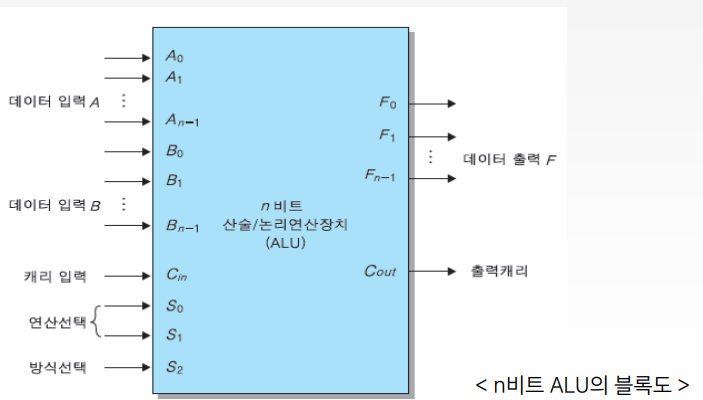
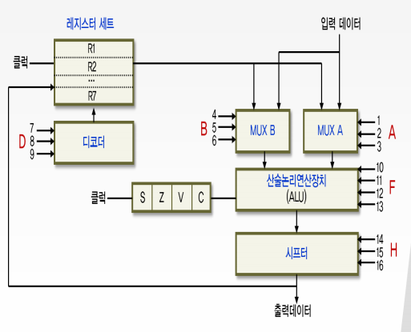

# 4강. 처리장치(2)

## 학습목차

1. 산술논리연산장치
2. 상태 레지스터
3. 시프터
4. 제어단어

## 1. 산술논리연산장치

### 3.3.3 산술논리연산장치

- 산술연산과 논리연산을 실행하는 조합논리회로

  - 산술연산회로와 논리연산회로의 결합

    

- 산술연산회로

  - 여러 개의 전가산기(FA)를 연속적으로 연결한 병렬가산기로 구성

  - 병렬가산기로 들어가는 제어입력 값을 선택하여 여러가지 형태의 산술연산을 실행

    

- 산술연산의 종류

  

- 논리연산회로

  - 레지스터에 이쓴 각 비트를독립된 2진 변수로 간주하여 비트별 연산을 실행

  - AND, OR, XOR, NOT연산 등이 있으며, 이를 이용하여 복잡한 연산을 유도

    

- 산술논리연산회로

  - 산술연산장치와 논리연산장치를 결합

    

    - 산술회로의 한 상태 - 8가지 산술 연산
    - 논리회로의 한 상태 - 4가지 논리 연산
    - 총 12가지 연산이 수행가능한 ALU(산술논리연산장치)

- ALU에 대한 연산표

  

  

## 2. 상태 레지스터

### 3.3.4 상태 레지스터 (flag register)

- ALU에서 산술연산이 수행된 후 연산결과에 의해 나타나는 상태 값을 저장

  - 상태 레지스터는 C(carry bit), S(sign bit), Z(zero bit), V(overflow bit)로 구성

    

## 3. 시프터

### 3.3.5 시프터(shifter)

- 입력 데이터의 모든 비트들을각각 서로 이웃한 비트로 자리를 옮기는 시프트 연산을 수행

  

- 시프트 연산의 종류

  

## 4. 제어단어

- 제어단어(control word)
  - 제어변수(선택신호)들의 묶음
  - 선택신호
    - 처리장치내에서 수행되는 `마이크로 연산`을 선택하는 변수
    - 처리장치의 버스, ALU, 쉬프터, 도착 레지스터 등을 제어
    - 선택신호 즉, 제어변수가 특정한 마이크로 연산을 선택
    - 이러한 제어 변수들의 묶음을 제어단어(control word)라 함
- 제어단어를 살펴보기 위해
  - 예를 들어 처리장치의 구성이 다음과 같다면
    - 레지스터 세트 : 7개의 레지스터 (R1 ~ R7)
    - 산술논리연산장치 : 12가지 연산을 수행
    - 시프터 : 6가지 연산을 수행
    - 제어단어를 구성하는 선택신호(제어변수)는?

- 처리장치의 구조에서 선택신호와 제어단어의 구성

  

- 제어단어의 내역

  - 예를 들어 처리장치의 구성이 다음과 같다면

    - 레지스터 세트 : 7개의 레지스터 (R1 ~ R7)

    - 산술논리연산장치 : 12가지 연산을 수행

    - 시프터 : 6가지 연산을 수행

      

      

      - 레지스터 세트 개수와 A, B, D 필드와 관련이 있다. 
        - 현재 7개의 레지스터니 2의 3승인 8에 적합하기 떄문에 3비트로 처리 가능하며
        - 레지스터 세트구성이 9개라면 4비트로 처리해야 한다.
      - 산술논리연산장치와 F 필드와 관련이 있다.
        - 12가지 연산을 수행하게 되면 2의 4승인 16에 포함되어 있기 때문에 4비트로 처리 가능하며
        - 20가지의 연산을 수행해야 된다고 했을 때 16에 포함되지 않기 떄문에 5비트로 처리해야 한다.
      - 쉬프터와 H 필드와 관련이 있다.
        - 6가지의 연산을 수행하게 되면 2의 3승인 8에 적합하기 떄문에 3비트로 처리 가능하다.
        - 10가지의 연산을 수행해야 된다면 8보다 크기 때문에 4비트로 처리해야 한다.

- 제어단어의 각 필드의 동작

  

  - A와 B필드의 3비트 : ALU로 입력되는 각각의 출발 레지스터를 선택
  - D필드의 3비트 : ALU의 결과가 저장될 도착 레지스터를 선택
  - F필드의 4비트 : ALU에서 이루어지는 12가지 연산중 하나를 선택
  - H필드의 3비트 : 시프터에서의 시프트 연산 중 하나를 선택
  - `전체 16비트로 구성된 선택신호들의 모임(제어단어)을 처리장치의 각 구성요소에 가하면`
    - 해당 마이크로 연산이 수행됨

- 제어단어의 내역표

  

- 제어단어의 작성 예

  > R1 ← R2 - R3

  

  1. A 필드 : ALU의 A 버스 입력으로 R2의 내용을 보낸다.
  2. B 필드 : ALU의 B 버스 입력으로 R3의 내용을 보낸다.
  3. F 필드 : ALU에서 감산 연산(F = A - B)을 수행한다.
  4. H 필드 : 시프터에서 연산을 수행하지 않는다.(시프트 없음)
  5. D 필드 : 연산 결과를 도착 레지스터 R1으로 보낸다.

- 제어단어의 작성 방법(R1 ← R2 - R3)

  

- 여러가지 마이크로 연산에 대한 제어단어의 예

  

- 제어단어 생성을 위한 효과적인 방법

  - 작성된 제어단어를 기억장치에 저장하고, 기억장치의 출력을 처리장치의 각 구성요소의 선택신호로 연결
  - 이렇게 하면 기억장치로부터 연속적인 제어단어를 읽음으로써 처리장치에서의 마이크로 연산이 정해진 순서대로, 연속적으로 수행된다. => 제어장치의 역할

