# 5강. 제어장치(1)

## 학습목차

1. 제어장치의 개요
2. 제어장치의 구성
3. 제어장치의 구현 방법
4. 마이크로프로그램에 의한 제어장치

## 1. 제어장치의 개요

#### 제어장치의 정의

- 컴퓨터 시스템의 모든 장치들을 유기적으로 제어하는 장치

#### 제어장치의 역할

- 기억장치에 저장된 프로그램으로 부터 명령어를 순차적으로 하나씩 읽어내어 연산코드 부분을 해독한 후, 그 결과에 따라 컴퓨터 시스템의 각 요소를 동작시키는 `제어 신호를 발생시켜 명령어를 수행`한다.
  - 하나의 명령어는 한 클럭동안 수행되는 마이크로 연산의 집합으로 구성
  - 명령어의 실행은 이러한 마이크로 연산의 연속적인 반복으로 이루어짐
- `결국 제어장치는 요구되는 마이크로 연산을 연속적으로 수행하게 하는 신호를 보내어 명령어를 수행하게 하는 역할을 한다.`

#### 제어장치와 처리장치와의 관계

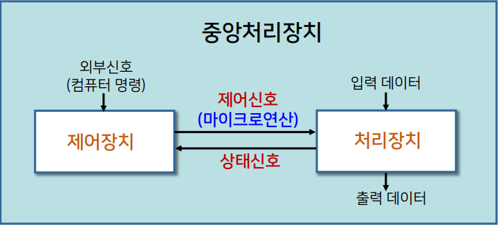

## 2. 제어장치의 구성

#### 구성요소

- 명령어 레지스터, 명령어 해독기, 순서 제어기, 주소 처리기

  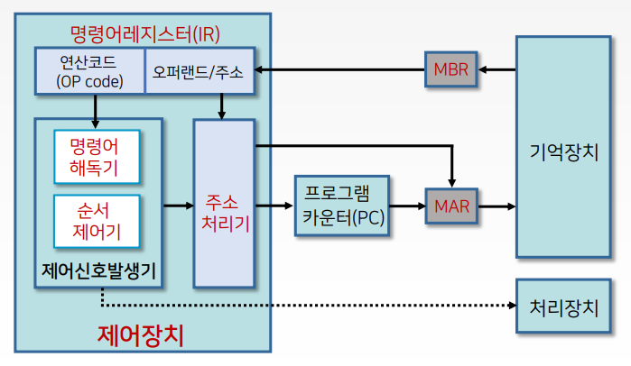

#### 제어장치의 동작(명령어 수행과정)

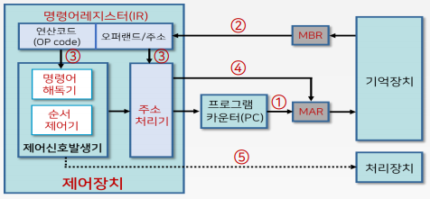

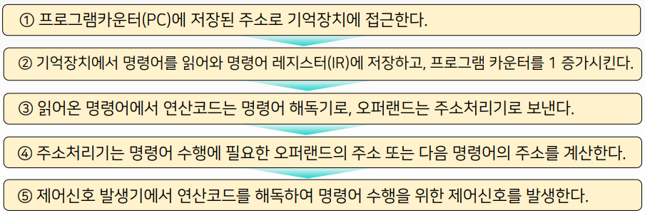

- MAR - memory address register
- MBR - menory berfer register
- ②에 프로그램 카운터를 1 증가시키는 이유
  - 다음에 수행될 명령어의 주소를 가리켜준다.

## 3. 제어장치의 구현 방법

#### 제어장치의 유형

- 마이크로프로그램에 의한 제어장치
  - 제어단어와 같은 제어정보를 특별한 기억장치에 기억시킨 구조
  - `프로그램에 의한 제어방식`
    - 장점 : 제어신호를 수정하고자 할 때 융통성이 뛰어남
    - 단점 : 기억장치에서 명령을 인출하는 별도의 시간 때문에 속도가 느림
    - 고밀도 집적회로(VLSI)가 가능하여 대부분의 컴퓨터에서 사용
- 하드웨어에 의한 제어장치
  - 순서회로와 같은 게이트와 플립플롭(flip-flop)으로 이루어짐
    - 장점 : 순서회로로 구성되기 때문에 고속 동작이 가능
    - 단점 : 회로의 동작방법이 바뀌면 다시 설계해야 함
    - 특수한 컴퓨터에서 사용

## 4. 마이크로프로그램에 의한 제어장치

#### 제어방식

- 제어 변수 값들을 `여러 개의 단어로 결합`하여 표현하고, 그것을 `연속적으로 읽어서 제어논리회로에 공급하여 동작`시키는 방식

#### 제어장치의 역할

- 일련의 마이크로 연산을 순차적으로 수행하도록 제어
- 이러한 제어를 위해 제어변수로서 제어단어를 사용

#### 제어단어

- 0과 1의 스트링으로 표현
- 제어단어를 이용하여 처리장치의 여러 구성요소들이 특정 시점에서 연산을 시작하도록 프로그램이 가능

#### 제어단어와 처리장치

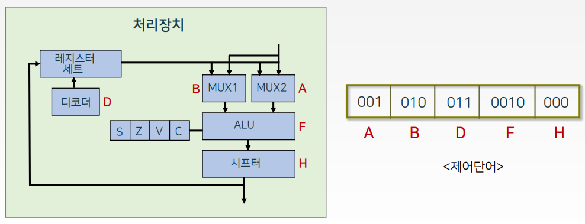

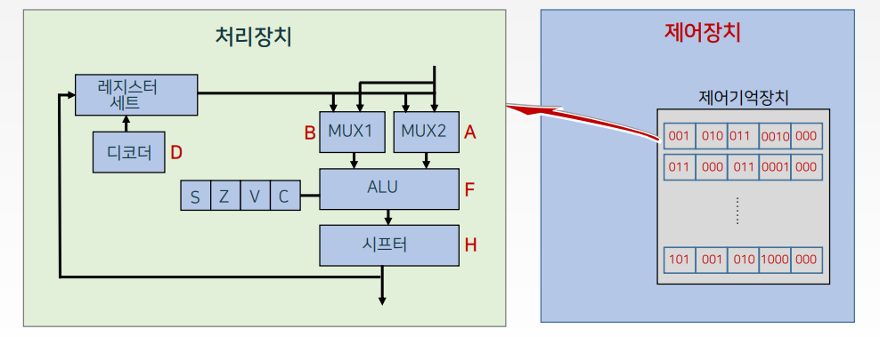

#### 구성도

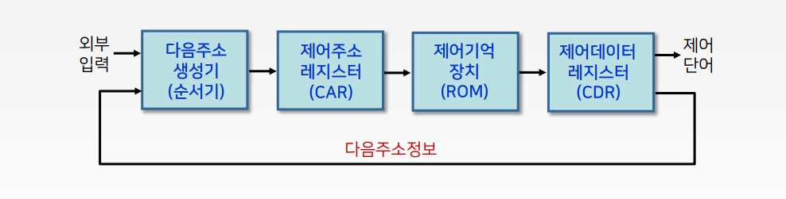

#### 구성 요소

- 제어기억장치
  - 모든 제어정보를 항상 저장하고 있는 기억장치(ROM)
- 제어 주소 레지스터 (CAR: Control Address Register)
  - 제어기억장치에 있는 마이크로 명령어의 주소를 나타낸다
- 제어 데이터레지스터(CDR: Control Data Register)
  - 제어기억장치에서 읽어온 마이크로 명령어를 저장하고 있다.
  - 시스템의 간소화를 위해 일반적으로 생략

#### 구성요소의 동작원리

- 제어기억장치
  - `마이크로 명령어들이 저장되어 있다.`
  - 저장된 마이크로 명령어는 하나 또는 다수의 마이크로 연산을 나타내는 제어단어를 포함하고 있다.
  - 마이크로 명령어가 모두 수행되고 나면, 다음에 수행될 마이크로 명령어의 주소를 결정해야 한다.
  - 다음 마이크로 명령어의 주소를 결정하기 위해서는 주소 정보가 현재의 마이크로 명령어 내에 한 비트 혹은 여러 비트로 있어야 한다.
- 다음주소 생성기(순서기)
  - 다음에 수행될 마이크로 명령어의 주소를 만들어 낸다.
  - 이 주소는 다음 클럭 펄스가 입력될 때 CAR로 이동되어 ROM으로 부터 다음 마이크로 명령어를 읽어내는데 사용된다.
  - 따라서 마이크로 명령어 내에는 처리장치의 마이크로 연산을 실행시키는 제어 비트와 실행될 마이크로 명령어의 순서를 정하는 비트가 포함되게 된다.
  - 다음 마이크로 명령어의 주소는 순서기의 입력에 따라 다양한 방법으로 결정 될 수 있다.
    1. CAR 의 1 증가 (다음주소 1증가)
    2. 제어기억장치의 주소를 CAR로 적재
    3. 외부로부터 온 주소를 CAR로 적재
    4. 제어동작을 시작하는 초기주소 적재
- 제어 주소레지스터(CAR)
  - 다음에 읽을 마이크로명령어의 주소를 제어하는 레지스터
- 제어 데이터레지스터(CDR)
  - 다음 주소가 계산되어 다음 마이크로 명령어가 제어기억장치로부터 읽혀질 때까지 현재의마이크로 명령어를 저장한다.

#### 구성도(2)

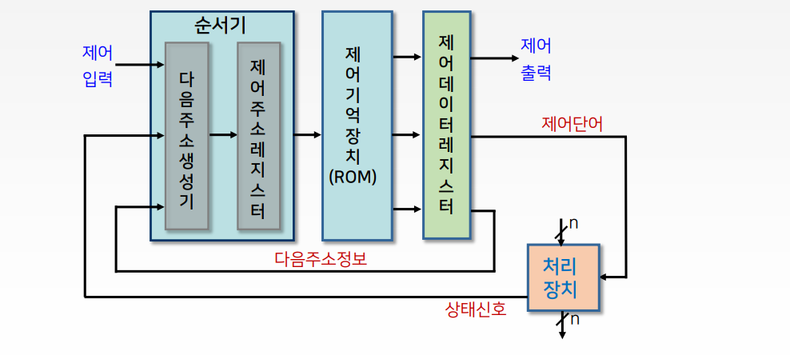

#### 구성도 (3)

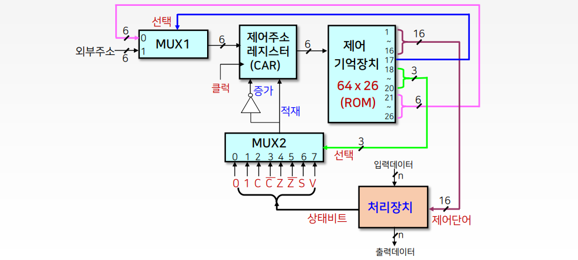

#### 구성요소 예(구성도 (3)의 경우)

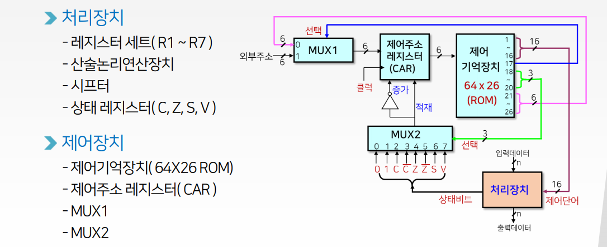

#### 제어장치의 동작

- 제어기억장치에 저장된 `마이크로 명령어(제어단어 포함)`에 의해 동작

- 마이크로 명령어의 내역 예(구성도 (3)의 경우)

  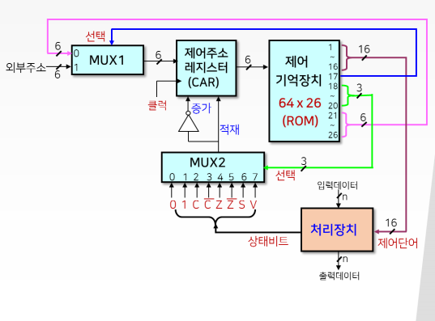

  - 모두 26비트로 구성됨
    - 처리장치 제어를 위한 16비트(제어단어)
    - 다음주소 선택을 위한 10비트

#### 마이크로 명령어의 내역

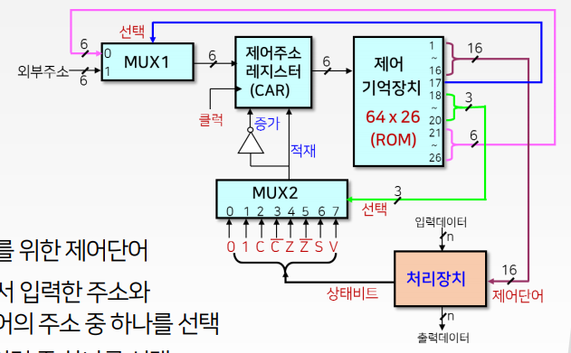

- 26비트의 구체적인 내역
  - 16비트(1~16) : 처리장치 제어를 위한 제어단어
  - 1비트(17) : MUX1에서 외부에서 입력한 주소와 내부 마이크로 명령어의 주소 중 하나를 선택
  - 3비트(18~20) : MUX2의 8개 입력 중 하나를 선택
  - 6비트(21~26) : ROM의 64단어를 선택하기 위한 주소 비트

#### 제어장치의 동작

- CAR에 새로운 주소가 들어오면 , 이 주소에 있는 26비트의 마이크로 명령어를 제어기억장치로 부터 인출
- 마이크로 명령어의 제어단어는 CAR의 다음 동작을 결정
- 처리장치에서 해당하는 상태비트를 새로운 값으로 갱신하며, 다음 주소를 CAR로 전송
- CAR의 새로운 주소는 제어기억장치의 다음 마이크로 명령어를 지정
- 이러한 과정을 각 클럭의 천이 떄마다 반복

#### 구성요소별 제어장치의 동작

- MUX1 : 외부주소나 내부주소 중의 하나를 선택
  - 선택 신호 = 0
    - 현재의 마이크로 명령어의 주소 부분을 CAR로 적재
  - 선택 신호 = 1
    - 외부주소를 CAR로 적재
- MUX2 : 상태비트의 값에 따라 CAR의 동작을 결정
  - 선택 신호 3비트
    - MUX2의 입력 중 하나를 선택하여 CAR에서 수행될 동작을 결정

