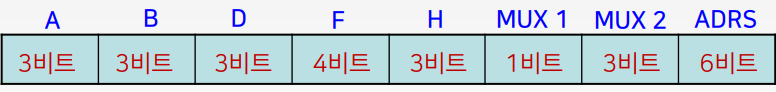
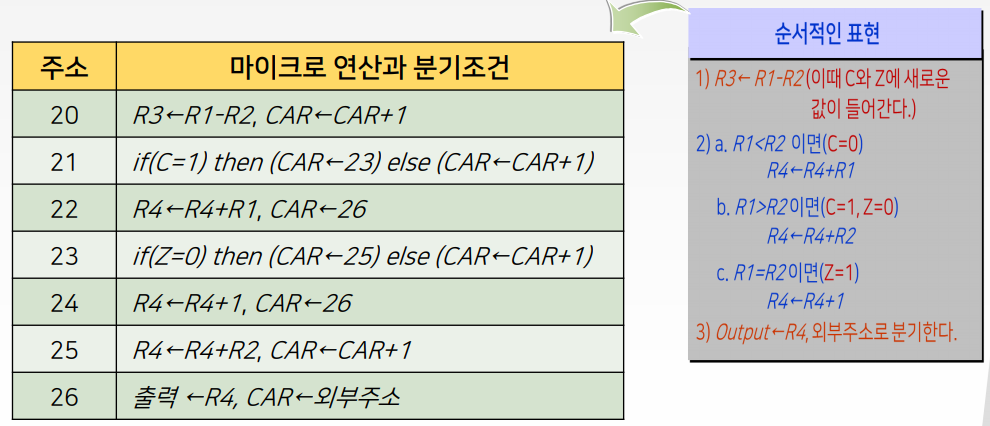
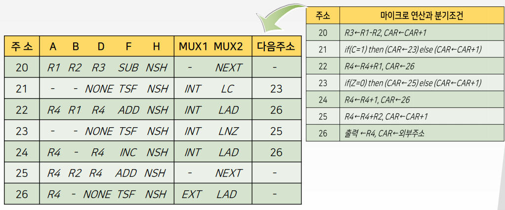
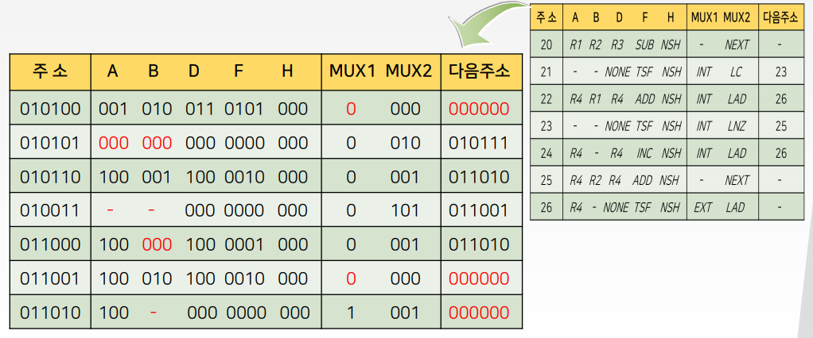
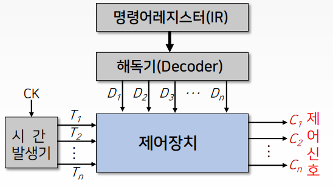
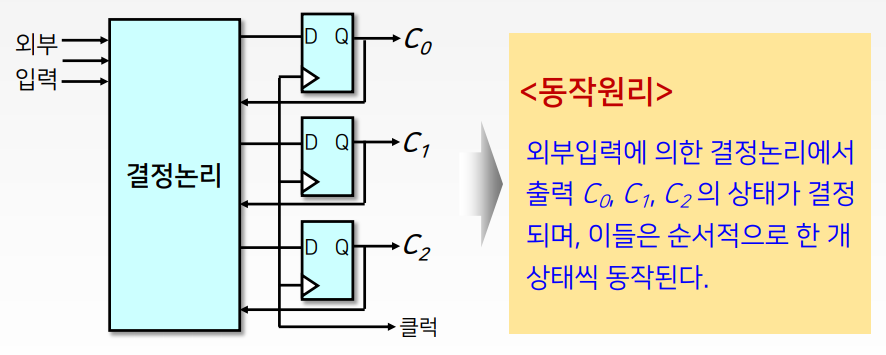
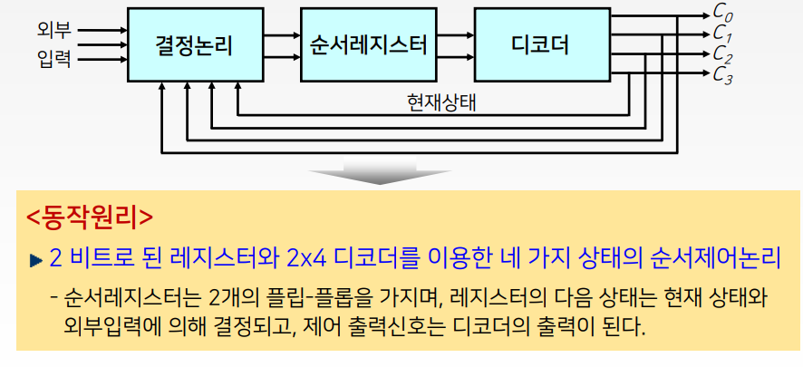

# 6강. 제어장치 (2)

## 학습목차

1. 마이크로명령어 형식
2. 마이크로프로그램의 개념
3. 마이크로프로그램의 작성
4. 하드웨어에 의한 제어

## 1. 마이크로명령어 형식

#### 구성내역 (26비트의 예)

- 8개의 필드로 구성

  

  - A 필드 : 처리장치의 레지스터 중 하나의 출발 레지스터 선택
  - B 필드 : 처리장치의 레지스터 중 다른 하나의 출발 레지스터 선택
  - D 필드 : 처리장치의 레지스터 중 도착 레지스터 선택
  - F 필드 : 처리장치의 ALU 연산 선택
  - H 필드 : 처리장치의 시프트 연산 선택
  - MUX 1 필드 : `0과 1`로서 `내부와 외부 주소`를 선택
  - MUX 2 필드 : 상태비트의 값에 따라 CAR을 구동
  - ADRS 필드 : ROM의 2진 번지에 해당하는 10진 주소

  

  - A~H 필드 : 16비트
  - MUX 1, MUX 2, ADRS : 10비트
  - 현재 26비트의 예로 설명을 하는 것이며, 
  - 처리장치와 제어장치에 구성요소에 따라 비트수가 달라질 수 있다.

#### 마이크로명령어 형식의 예

- 각 필드의 내역

  

  | 비트  | 필드  | 기     호          | 기     능                     |
  | ----- | ----- | ------------------ | ----------------------------- |
  | 1~3   | A     | INP, R1 ~ R7       | 출발 레지스터 선택            |
  | 4~6   | B     | INP, R1 ~ R7       | 출발 레지스터 선택            |
  | 7~9   | D     | NONE, R1 ~ R7      | 도착 레지스터 선택            |
  | 10~13 | F     | ALU의 연산 참조    | ALU 연산 선택                 |
  | 14~16 | H     | 시프터의 연산 참조 | 시프터 연산 선택              |
  | 17    | MUX 1 | INT, EXT           | MUX 1 선택 (INT = 0, EXT = 1) |
  | 18~20 | MUX 2 | 상태비트 참조      | MUX 2 선택                    |
  | 21~26 | ADRS  | 주소               | ROM의 단어 선택               |

#### 마이크로명령어 형식의 예

- MUX 2의 선택기능

  | 2진 코드 | 기호 | 기능                                   |
  | -------- | ---- | -------------------------------------- |
  | 000      | NEXT | CAR을 증가(다음 주소로 간다)           |
  | 001      | LAD  | CAR에 주소를 적재(무조건 분기)         |
  | 010      | LC   | 캐리가 있으면 적재(C=1 이면 분기)      |
  | 011      | LNC  | 캐리가 없으면 적재(C=0 이면 분기)      |
  | 100      | LZ   | 제로면 적재(Z=1 이면 분기)             |
  | 101      | LNZ  | 제로가 아니면 적재(Z=0 이면 분기)      |
  | 110      | LS   | 부호가 바뀌었으면 적재 (S=1 이면 분기) |
  | 111      | LV   | 범람이 발생했으면 적재(V=1 이면 분기)  |

#### 마이크로 명령어의 예

- 마이크로프로그램이 아님

  

  - \<예1\> 주소 36에 저장되어 있는 마이크로 명령어
    - R1 ← R2 ＾R2, CAR ← CAR + 1
  - \<예2\> 주소 40에 저장되어 있는 마이크로명령어
    - R3 ← R3 - 1, CAR ← 43
  - \<예3\> 주소 52에 저장되어 있는 마이크로명령어
    - R4 ← 0, if(S=1) then(CAR ← 37) else (CAR ← CAR + 1)
  - \<예4\> 주소 59에 저장되어 있는 마이크로명령어
    - R2 ← R6 + R7, CAR ← 외부주소

## 2. 마이크로프로그램의 개념, 작성

#### 마이크로프로그램이란?

- 제어기억장치에 저장된 인련의 마이크로명령어들의 집합
  - 마이크로프로그램 루틴(microprogram routine)
- 이러한 마이크로프로그램을 이용하여 제어장치를 구현
  - 마이크로프로그램에 의한 제어장치

#### 작성 예

- 동작 예

  - 레지스터 R1의 내용에서 R2의 내용을 빼서 그 결과를 R3에 저장한다.
  - 또한 R1과 R2의 내용 중에서 작은 수를 R4에 더하고, 만약 R1과 R3의 내용이 같으면 R4를 1 증가시킨다.
  - 마지막으로 R4의 내용을 처리장치의 출력단자로 내보낸다.

- 순서적인 표현

  1. R3 ← R1 - R2 (이때 C와 Z에 새로운 값이 들어간다.) c = 캐리, z = 제로

  2. a. R1 < R2 이면 (C = 0)

     ​	R4 ← R4 + R1

     b. R1 > R2 이면 (C = 1, Z = 0) 

     ​	R4 ← R4 + R2

     c. R1 = R2 이면 (Z = 1)

     ​	R4 ← R4 + 1

  3. Output ← R4, 외부주소로 분기한다.
  
- 레지스터 전송문

  - 마이크로프로그램 루틴은 20번지에서 시작하여 외부번지로 분기한다고 가정

    

    

    

#### 마이크로프로그램의 개념

- 제어장치 설계를위한 시스템적인 접근과정
- 마이크로명령어 형식을 설정하면마이크로프로그램의 작성과정은 컴퓨터의 프로그램 작성과정과 유사
- 이러한 이유로 펌웨어(firmware)라고도 함

## 3. 하드웨어에 의한 제어

#### 하드웨어에 의한 제어장치

- 주어진 시간에 처리장치에서 수행할 마이크로연산을 결정해주는 `제어상태를 갖는 순서회로`

#### 블럭도

#### 제어장치의 설계

- 입력신호들에 따라 출력신호들을 발생하도록 내부논리 설계
- 각 제어신호에 대한 부울 표현식이 입력함수로 구현
- 결국 제어장치의 설계는 `순서회로의 설계`이다.
- `일반적으로 제어순서의 상태도를 이용하여 설계`

#### 제어장치의 구현 방법

1. 상태 플립-플롭을 이용한 제어방식
2. 순차 레지스터와 디코더를 이용한 제어방식

#### 1) 상태 플립-플롭을 이용한 제어방식

#### 2) 순차 레지스터와 디코더를 이용한 제어방식

- 레지스터 : 제어상태의 순서를 정하는데 사용
- 디코더 : 각 상태마다 하나의 출력만을 나오도록 사용
- n-비트 순서 레지스터 : n개의 플립-플롭과 게이트로 구성

#### 순서 레지스터와 디코더를 이용한 제어방식의 구성도

#### 장점

- 순서회로를 사용함으로써 부품의 수는 최소화 되고, 동작속도는 극대화 된다.

#### 단점

- 시스템이 복잡해지면 설계가 어렵고, 한번 구성되면 바꾸기가 어렵다.

#### `RISC 방식에 사용`

