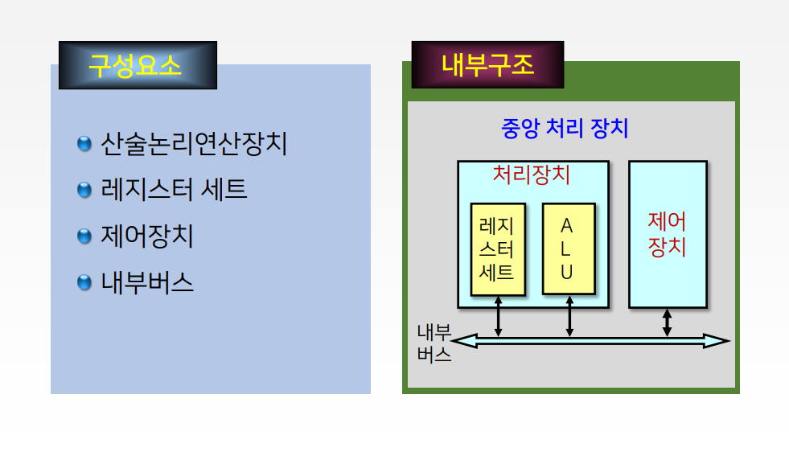
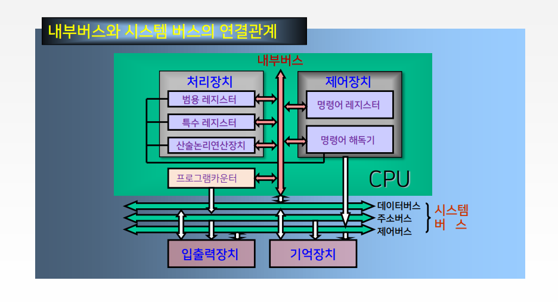
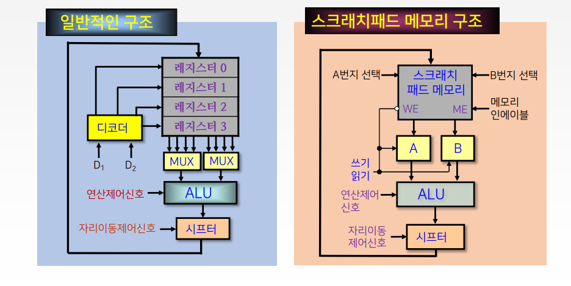
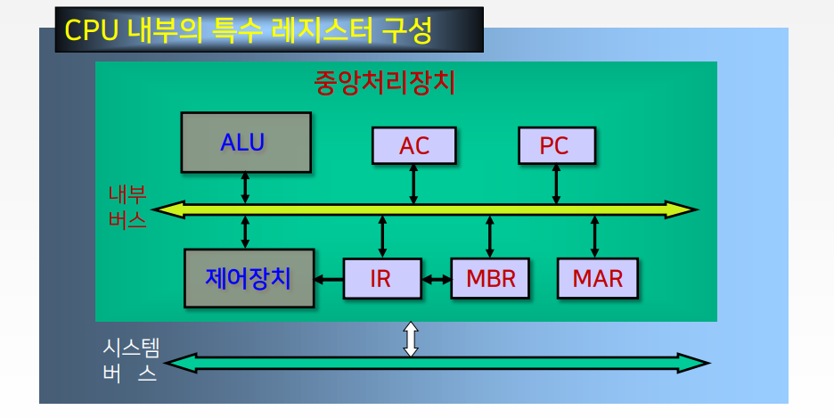
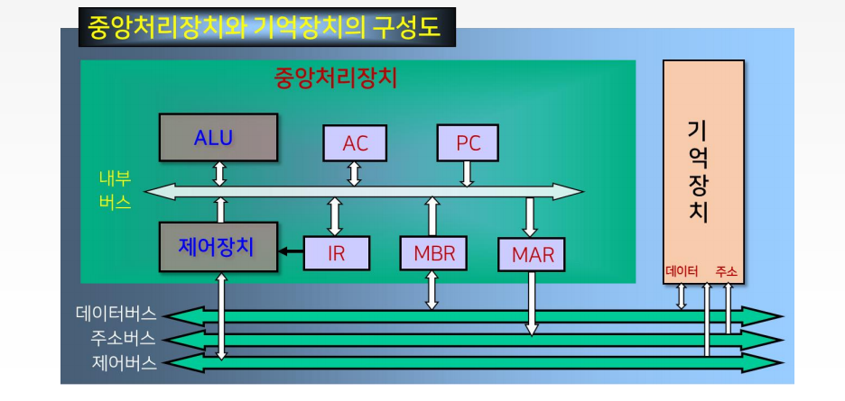

# 7강. 중앙처리장치 (1)

## 학습목차

1. 중앙처리장치의 개요
2. 중앙처리장치의 내부 구조
3. 레지스터
4. 명령어 사이클의 개념

## 1. 중앙처리장치의 개요, 내부구조

### 중앙처리장치(CPU)

- 컴퓨터에서 명령어를 수행하고 데이터를 처리하는 장치
- 프로그램이 수행되는 전반적인 과정을 제어
- 처리장치와 제어장치로 구성

### 중앙처리장치 내부 구조

### 중앙처리장치의 구성요소

#### 산술논리연산장치(ALU)

- 구성요소
  - 산술연산장치, 논리연산장치, 시프터, 상태레지스터, 보수기
  - 상태 레지스터(status/flag register)
    - 연산결과의 상태를 나타내는 플래그(flag)를 저장하는 레지스터
  - 보수기(complementer)
    - ALU내의 데이터에 대해 보수연산을 수행

#### 레지스터 세트

- CPU내의 레지스터 집합
- 기억장치 중 액세스 속도가 가장 빠르다.
- 따라서 CPU에서의 빠른 처리속도를 지원
- 빠른 속도를 갖지만 가격이 비싸므로, CPU내의 레지스터의 수는 제한된다.

#### 제어장치

- 프로그램에 의한 연산의 순서대로 기억장치, 연산장치, 입출력장치에 제어신호를 발생한다.

- 제어장치의 동작

  - 1 단계 : 명령어를 해독하고, 명령어 레지스터에 저장

  - 2 단계 : 명령어 레지스터에 저장된 명령어 실행

    

#### 내부버스

- ALU와 레지스터 간의 데이터 전송을 위한 통로
  - 데이터 버스와 제어버스로 구성
- 외부장치(기억장치, 입출력장치)와 데이터 전송
  - 시스템 버스와 연결
  - 시스템 버스 : 데이터, 주소, 제어 버스로 구성

#### 내부 버스와 시스템 버스의 연결관계

## 2. 레지스터

### 레지스터의 종류

#### 범용 레지스터 (general purpose register)

- 데이터를 일시적으로 저장
  - 앞장에서 R1, R2로 쓰엿던 기본 레지스터

#### 특수 레지스터(special purpose register)

- 특수한 기능을 수행
  - 프로그램 카운터 PC, 스택 최상위 포인터 SP 등등

### 범용 레지스터

- 데이터 저장과 같은 일반적인 목적을 위한 레지스터
- CPU 내부에 있는 소규모의 일시적인 기억장치로, 프로그램의 진행 도중 가까운 시간 내에 사용할 데이터나 연산결과를 일시적으로 기억시키는데 사용
- 데이터를 연산할 때 메모리로부터 데이터를 인출할 경우 호출시간이 많이 걸리기 때문에 CPI내부의 레지스터에 데이터를 기억시켜두고 연산한다.

### 범용 레지스터의 형태

### 특수 레지스터

#### CPU 내부의 특수 레지스터 구성

### 프로그램 카운터 (PC: Program Counter)

- 다음에 수행되어질 명령어가 있는 주소를 갖고 있다.
  - 즉, 데이터가 저장되어 있는 기억장치의 주소를 지정
- 현재 처리하려고 하는 데이터를 인출한 후에는 자동적으로 1증가
- 프로그램 카운터의 비트 수는 기억장치의 용량에 따라 결정된다.
  - <예> 기억장치 전체 영역이 256MByte(=228)라면 프로그램 카운터의 비트수는 28비트이다.

### 명령어 레지스터 (IR: Instruction Register)

- 프로그램의 수행 중 가장 최근에 기억장치로부터 인출되어진 명령어를 갖고 있다.
- 명령어 레지스터의 비트 수는 명령어의 연산코드의 비트수와 같다.

### 누산기(AC: Accumulator)

- 데이터를 일시적으로 저장하는 레지스터
- 입력장치로부터 데이터를 받아들이거나, 출력장치로 데이터를 전송하는데 사용
- 산술 및 논리연산이 이루어질 경우에는 오퍼랜드나 연산 결과를 일시적으로 기억하는 레지스터
- CPU가 연산을 수행 한 후 그 결과는 반드시 누산기에 저장

### 기억장치 주소 레지스터(MAR: Memory Address Register)

- 기억장치 주소를 임시 저장하는 레지스터

### 기억장치 버퍼 레지스터(MBR: Memory Buffer Register)

- 기억장치로 쓰여질 데이터나 혹은 기억장치로부터 읽혀질 데이터를 임시로 저장하는 레지스터

### 스택 포인터 (SP: Stack Pointer)

- 스택 주소지정방식에서 사용된다.
- 스택영역의 번지를 지정해 주는 포인터
- 스택 영역은 실제로 데이터가 피신되는 기억장소로써 기억장치에 위치한다.
- 프로그램 카운터와 같은 크기의 비트수를 가진다.

## 3. 명령어 사이클의 개념

### 명령어 사이클

- 컴퓨터의 기본적인 기능은 기억장치에 기억되어 있는 프로그램을 실행하는 것
  - 실행되는 프로그램은 명령어로 구성
- 따라서 중앙처리장치는 기억장치에 저장되어 있는 명령어를 인출하여 실행함으로써 프로그램을 수행
- 이러한 명령어의 수행과정을명령어 사이클이라 한다.

### 중앙처리장치에서의 명령어 수행과정

#### 기억장치와 중앙처리장치의 레지스터들의 동작을 통해 살펴볼 수 있다.

- 명령어의 인출이란 (인출 사이클)
  - 프로그램 카운터(PC)를 통해 메모리 주소 레지스터(MAR)을 통해서 기억장치의 메모리로 접근하고
  - 접근한 메모리의 명령어들을 기억장치에서 외부버스(데이터 버스)를 통해 이동하여 메모리 버퍼 레지스터(MBR)로 이동을 하고
  - 내부버스를 통해 명령어 레지스터로 이동이 되어 졌을때 "인출" 되었다고 말할 수 있다.

#### 명령어 사이클(instruction cycle)

- 한 개의 명령어를 CPU에서 수행하는데 필요한 전체 수행 과정

#### 명령어 사이클의 종류

- 인출 사이클(fetch cycle)
- 실행 사이클(execute cycle)
- 간접 사이클(indirect cycle)
- 인터럽트 사이클(interrupt cycle)

