# 8강. 중앙처리장치(2)

## 학습목차

1. 명령어 사이클
2. 명령어 수행 과정
3. 간단한 컴퓨터의 설계

## 1. 명령어 사이클, 수행 과정

### 명령어 사이클 (instruction cycle)

- 한 개의 명령어를 CPU에서 수행하는데 필요한 전체 수행과정

### 명령어 사이클의 종류

- 인출 사이클(fetch cycle)
- 실행 사이클(execute cycle)
- 간접 사이클(indirect cycle)
- 인터럽트 사이클(interrupt cycle)

### 명령어 수행 과정

- 명령어 인출
  - 기억장치로부터 명령어를 가져오는 과정
    - 인출된 명령어의 주소는 PC(프로그램 카운터)에 들어있고, 인출된 명령어는 IR(명령어 레지스터)로 옮겨진다.
- 명령어 해석
  - 명령어를 해독하는 과정
    - 명령어의 종류에 따라 필요한 경우 오퍼랜드의 인출이 일어난다.
- 명령어 실행
  - 지정된 연산을 실행하는 과정
    - 간접주소지정인 경우 기억장치로부터 데이터가 들어있는 유효주소를 인출
- 저장
  - 명령어 실행단계에서 수행된 연산 결과가 레지스터 혹은 기억장치에 쓰여지는 과정
- 인터럽트 처리
  - 명령어 실행 도중에 입출력장치와 같은 다른 장치에 의해 인터럽트가 들어오면 그에 합당한 서비스를 제공하는 과정

### 명령어 인출 사이클

#### 기억장치에 저장되어 있는 명령어를 인출하는 과정

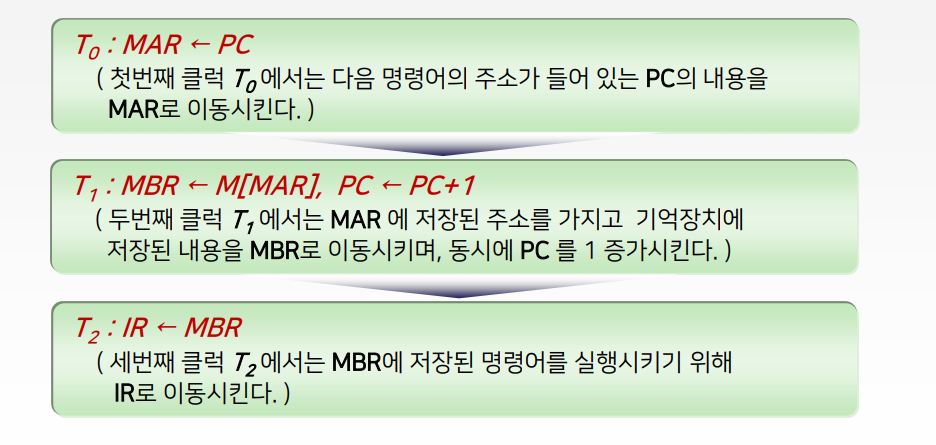

- PC - 다음 명령어의 주소가 들어가 있다.

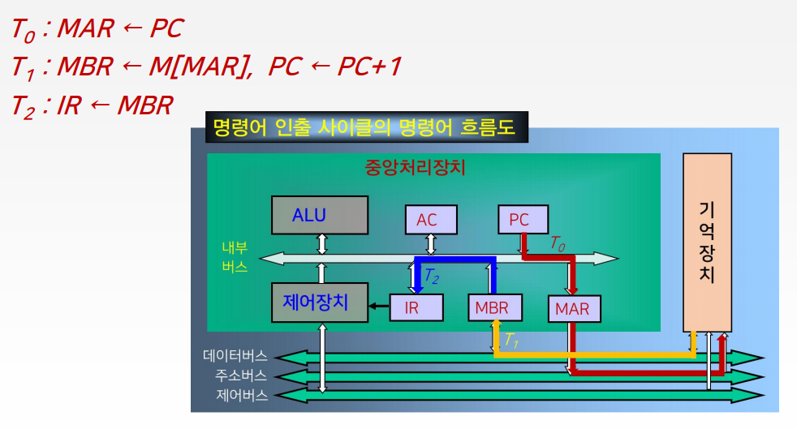

### 명령어 실행 사이클

#### 명령어를 실행하는 과정

- 이 과정에서는 명령어 인출과정을 통하여 IR레지스터에 실린 명령어를 해독하고, 해독한 명령어에 따라 필요한 연산이 수행된다.
- 수행되는 연산들의 기능
  - 데이터의 이동 기능 : 기억장치와 CPU 혹은 입출력 장치 사이에 데이터의 이동
  - 데이터의 처리 기능 : 산술 혹은 논리연산을 통한 데이터 처리
  - 데이터의 저장 기능 : 연산결과를 기억장치에 저장
  - 제어 기능 : 프로그램의 실행 순서를 결정

#### LOAD 명령어 실행 사이클

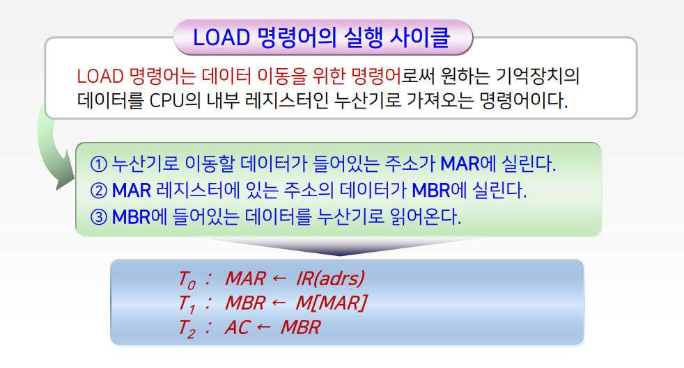

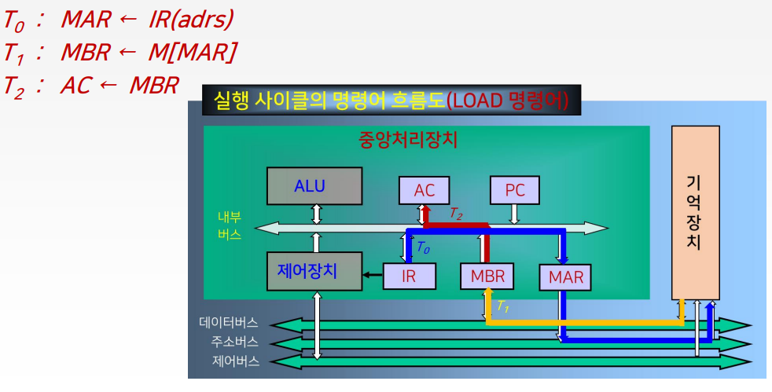

#### ADD 명령어 실행 사이클

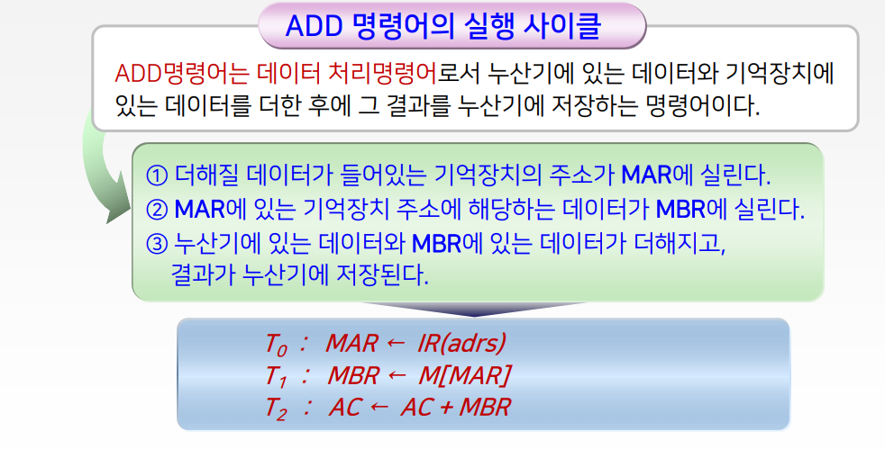

#### STORE 명령어 실행 사이클

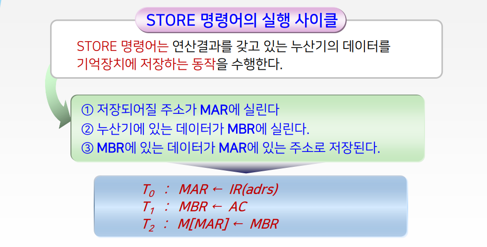

#### 분기 및 점프 명령어의 실행 사이클

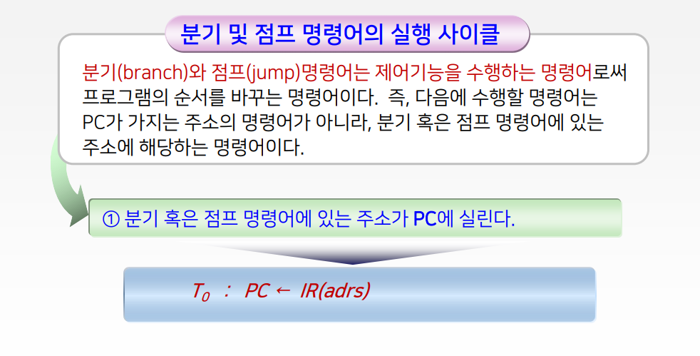

### 간접 사이클

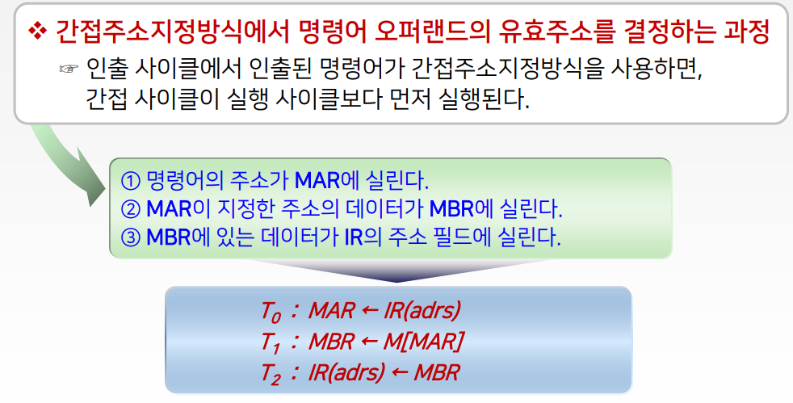

### 인터럽트 사이클

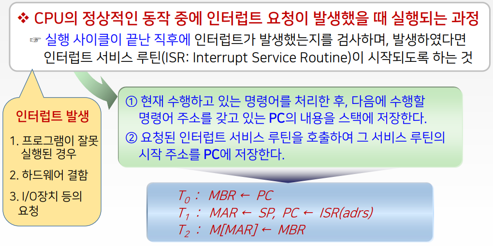

## 3. 간단한 구조의 컴퓨터 설계

### 설계 과정

- 기본적인 컴퓨터 구성 설계
- 컴퓨터 명령어 설계
- 명령어 분석을 통한 제어논리 설계
- 하드웨어에 의한 제어장치 설계

### 1. 기본적인 컴퓨터 구성 설계

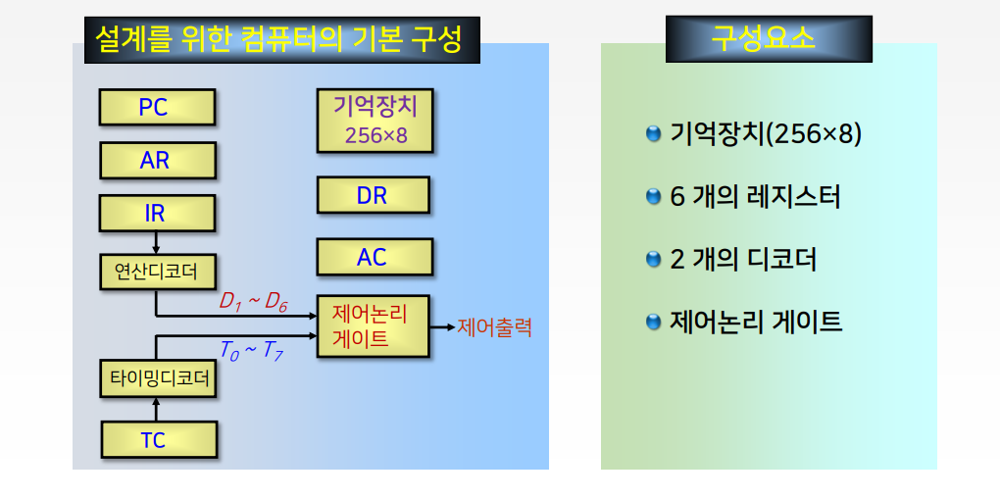

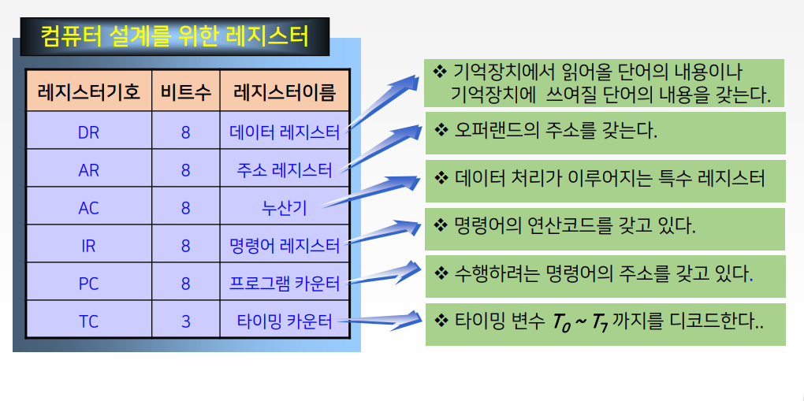

### 2. 명령어의 설계(예: 6개의 명령어)

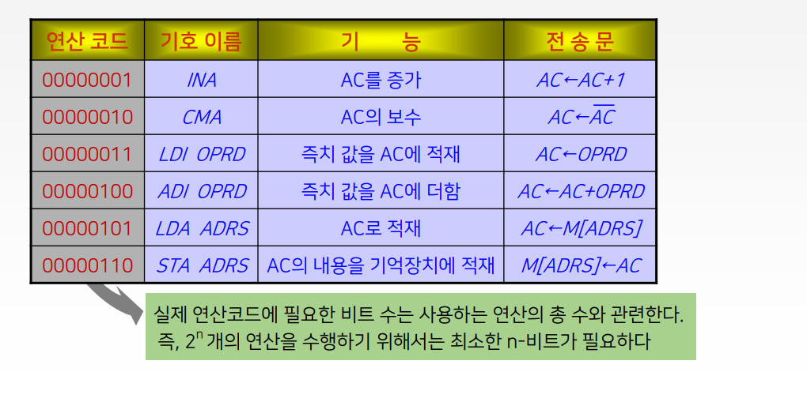

