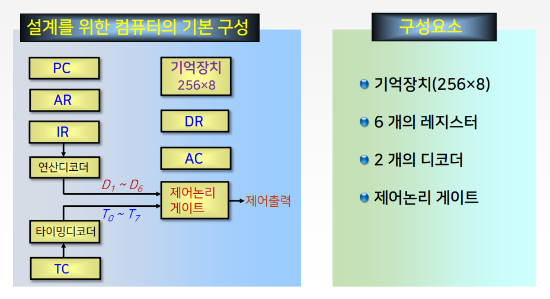
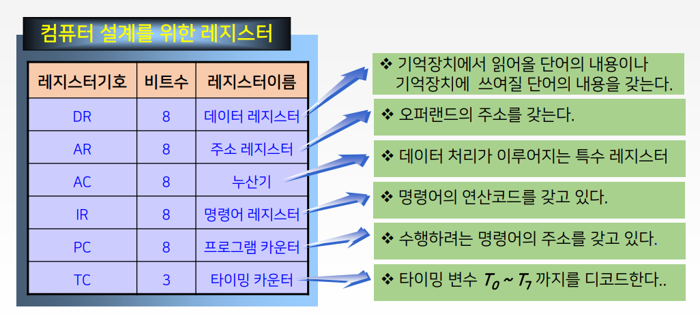
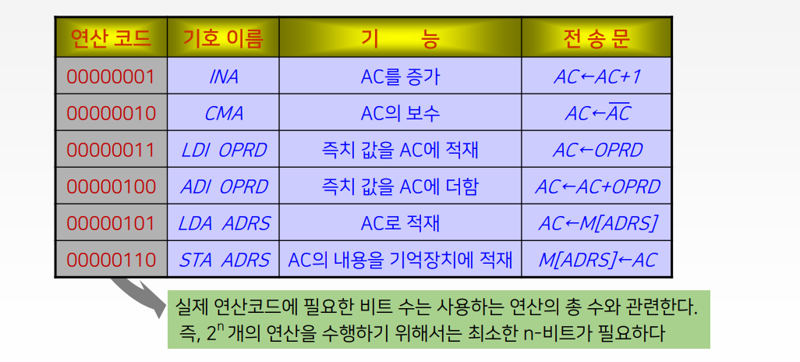
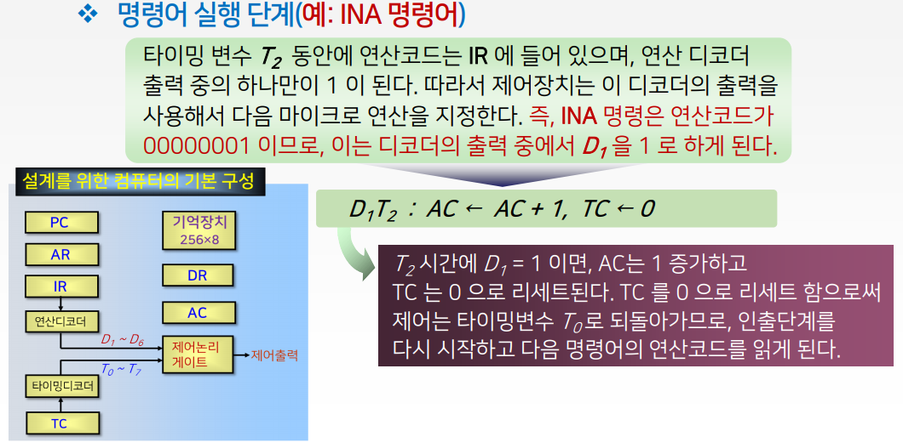
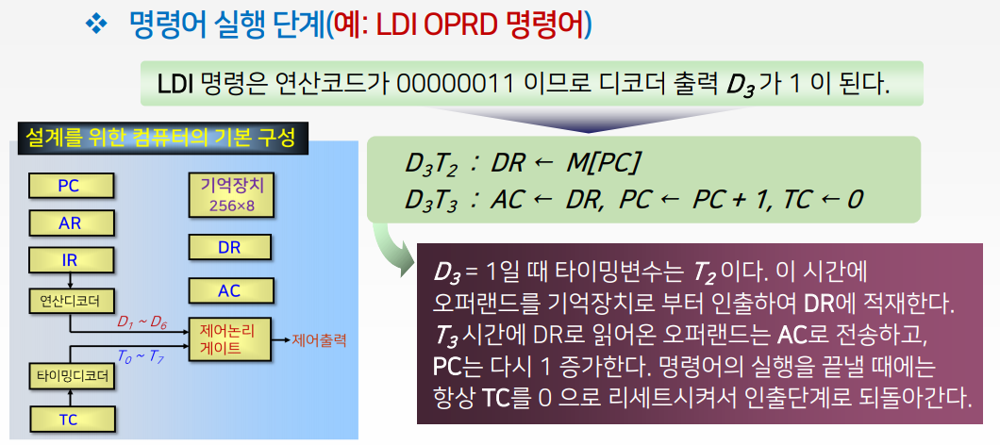
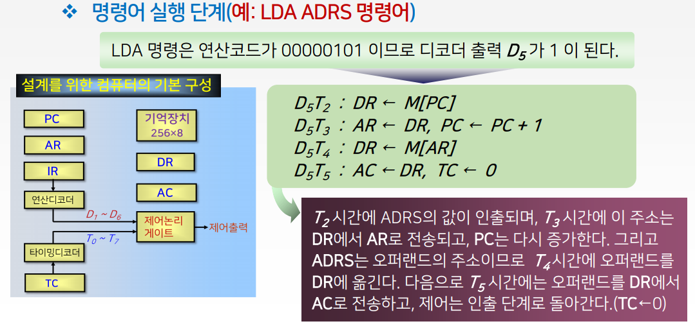

# 9강. 중앙처리장치 (3)

## 1. 간단한 구조의 컴퓨터 설계

### 설계과정

1. 기본적인 컴퓨터 구성 설계
2. 컴퓨터 명령어 설계
3. 명령어 분석을 통한 제어논리 설계
4. 하드웨어에 의한 제어장치 설계

### 1) 기본적인 컴퓨터 구성 설계

### 2) 명령어의 설계 (예: 6개의 명령어)

### 3) 명령어의 수행과정 분석

## 2. 명령어 파이프라이닝

## 3. CISC와 RISC의 비교

