# 9강. 중앙처리장치 (3)

## 1. 간단한 구조의 컴퓨터 설계

### 설계과정

1. 기본적인 컴퓨터 구성 설계
2. 컴퓨터 명령어 설계
3. 명령어 분석을 통한 제어논리 설계
4. 하드웨어에 의한 제어장치 설계

### 1) 기본적인 컴퓨터 구성 설계

### 2) 명령어의 설계 (예: 6개의 명령어)

### 3) 명령어의 수행과정 분석

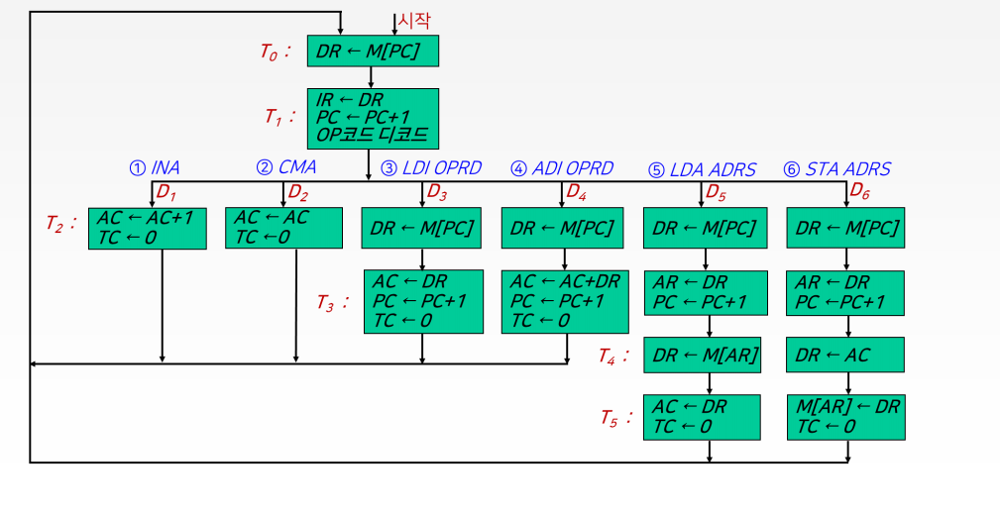

### 4) 제어논리의 설계

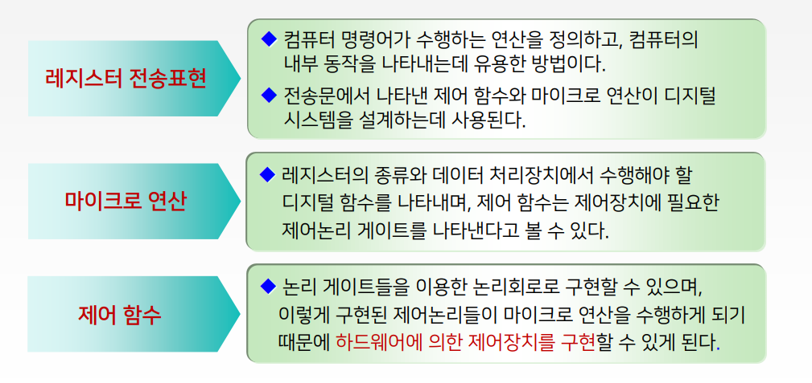

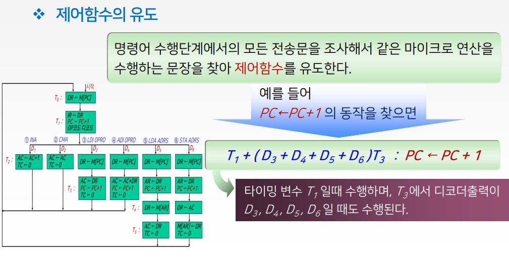

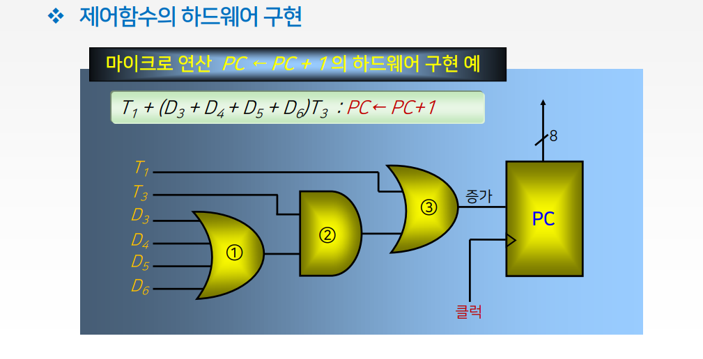

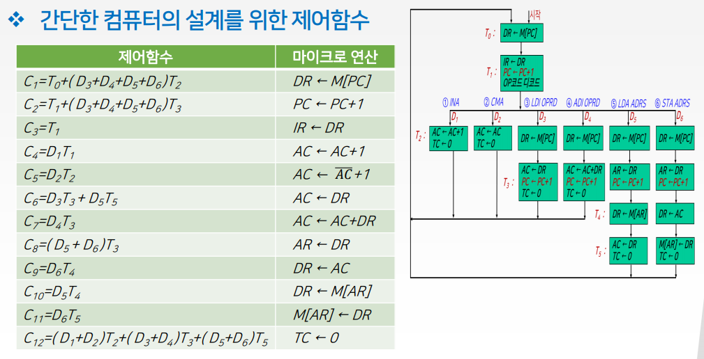

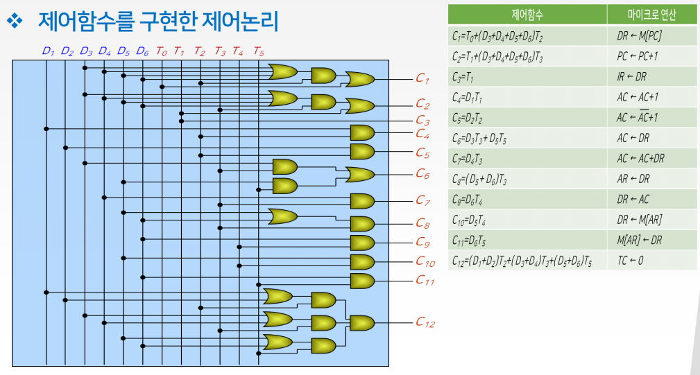

### 제어 함수를 이용한 컴퓨터 설계

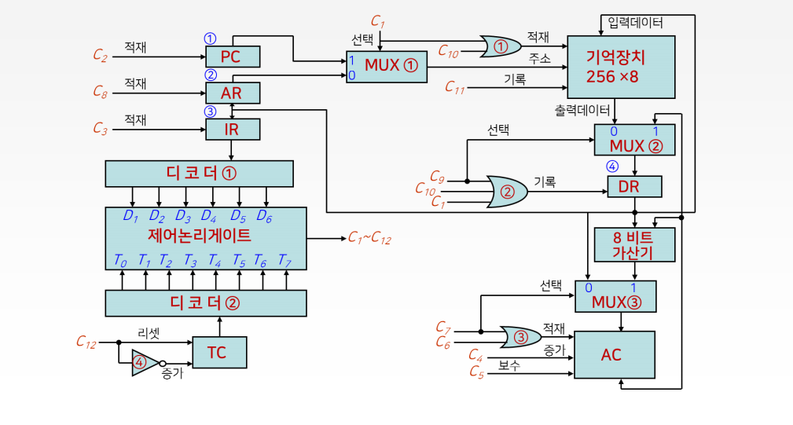

## 2. 명령어 파이프라이닝

### 파이프라이닝 (pipelining)

- 어떤 일을 실행하는데 있어서 하나의 일을 여러 단계로 나누어, 중첩되게 실행함으로써 성능을 높이는 방법

### 명령어 파이프라이닝(instruction pipelining)

- CPU의 처리속도를 향상시키기 위한 방법 중의 하나로서, CPU의 내부 하드웨어를 여러 단계로 나누어 처리하는 기술

### 명령어 파이프라이닝 방법

- 2단계 명령어 파이프라인
- 4단계 명령어 파이프라인
- 6단계 명령어 파이프라인

### 명령어 수행되는 컴퓨터 사이클을 2단계로 나누어 실행

1. 명령어 인출 단계
2. 명령어 실행 단계

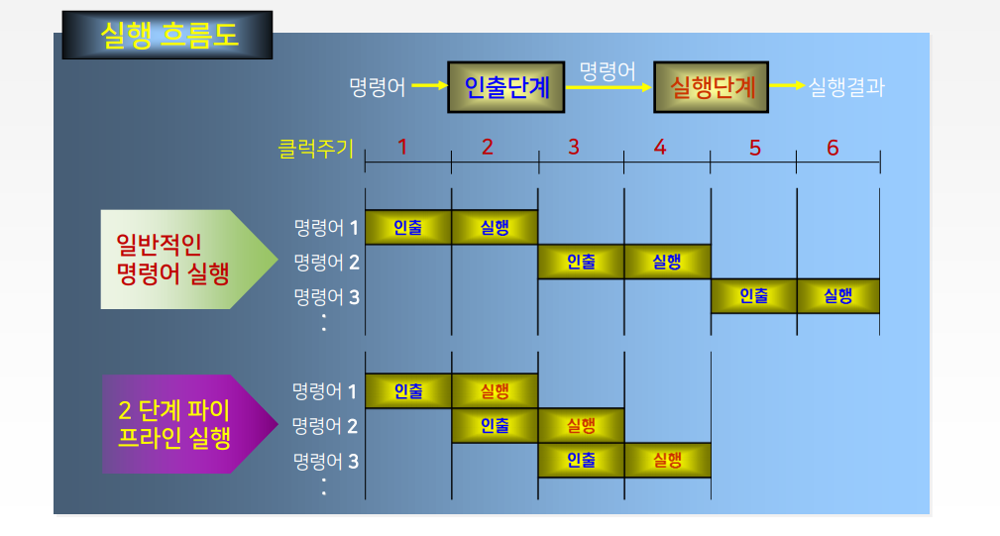

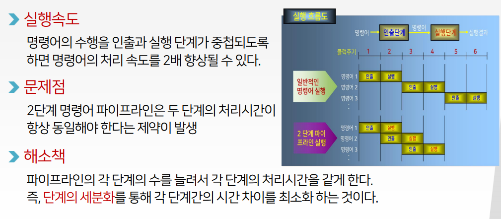

#### 명령어 수행단계를 4단계로 나누어 수행하는 구조

1. 명령어 인출 단계(IF)
2. 명령어 해독 단계(ID)
3. 오퍼랜드 인출단계(OF)
4. 명령어 실행단계(EX)

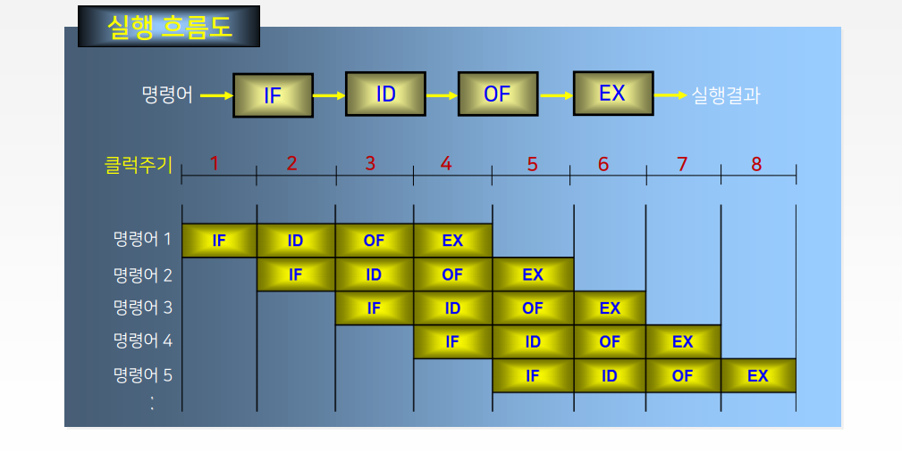

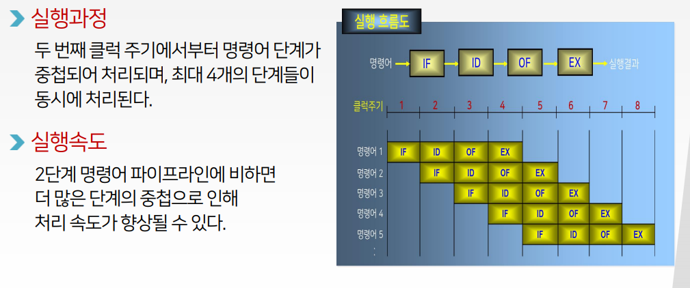

### 명령어 수행을 6단계로 나누어 수행하는 구조

1. 명령어를 인출하는 FI(Fetch Instruction) 단계
2. 명령어를 해독하는 DI(Decode Instruction) 단계
3. 오퍼랜드를 계산하는 CO(Calculate Operand) 단계
4. 오퍼랜드를 인출하는 FO(Fetch Operand) 단계
5. 명령어를 실행하는 EI(Execute Instruction) 단계
6. 연산된 결과 오퍼랜드를 저장하는 WO(Write Operand) 단계

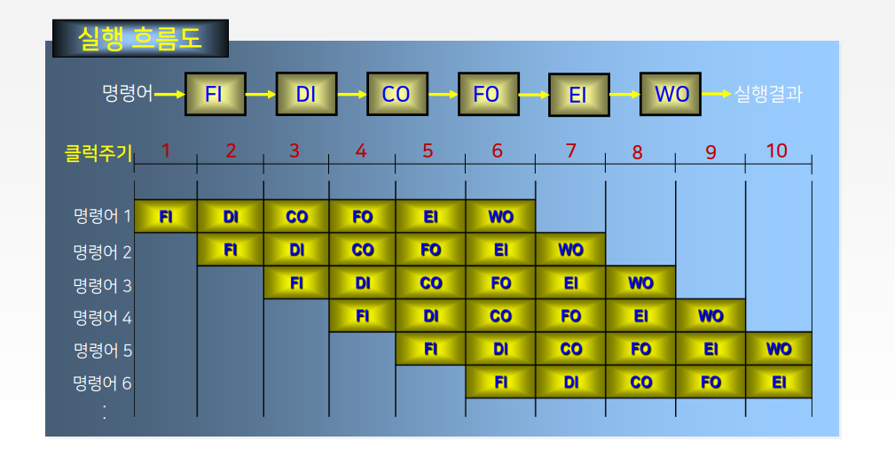

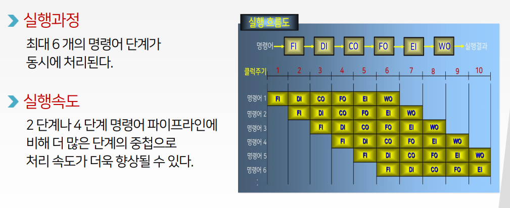

### 속도향상을 위한 조건

## 3. CISC와 RISC의 비교

### 명령어 세트

- CISC (Complex Instruction Set Computer) 복합 명령어 세트 방식
  - 명령어에 따라 다양한 길이를 갖는 가변길이 명령어 형식을 사용
  - 명령어 수행시간이 1 클럭에서 많게는 수백 클럭까지 소요된다.
  - 약 200여 개 이상의 명령어를 갖고 있다.
- RISC (Reduced Instruction Set Computer) 단축 명령어 세트 방식
  - 고정길이의 명령어 형식을 사용하기 때문에 명령어 집합이 단순
  - 모든 명령어가 1워드 단위로 고정되어 있기 때문에 1개 명령어를 수행하는데 1개 클럭만이 소요된다.
  - 약 30여 개의 명령어만을 가지고 있다.

### 제어장치의 구성

- CISC
  - 마이크로프로그램에 의한 제어방식으로 제어장치를 구성
- RISC
  - 하드웨어에 의한 제어방식으로 제어장치를 구성

### 레지스터 구조

- CISC
  - CPU 내부에 범용 레지스터의 수가 적다
  - 기억장치에 있는 데이터를 액세스 하기 위해서는 기억장치 접근이 자주 방생하며, 이는 컴퓨터의 성능 저하의 요인이 된다.
- RISC
  - CPU 내부에 많은 수(약 32개에서 200여 개)의 범용 레지스터가 있다.
  - 처리하고자 하는 데이터를 미리 CPU의 내부 레지스터로 가져와서 실행할 수 있으므로 처리 속도의 향상을 도모 할 수 있다.

### 파이프라인 적용 효율

- CISC
  - 명령어의 길이가 가변적이기 때문에 각 단계별의 처리시간을 동일하게 해주는 것이 어려우므로 파이프라인 구조에서는 비효율적이게 된다.
- RISC
  - 명령어가 고정길이 명령어 이기 때문에 각 단계별의 처리시간을 동일하게 해주는 것이 용이하므로 파이프라인 구조에 효율적으로 사용된다.